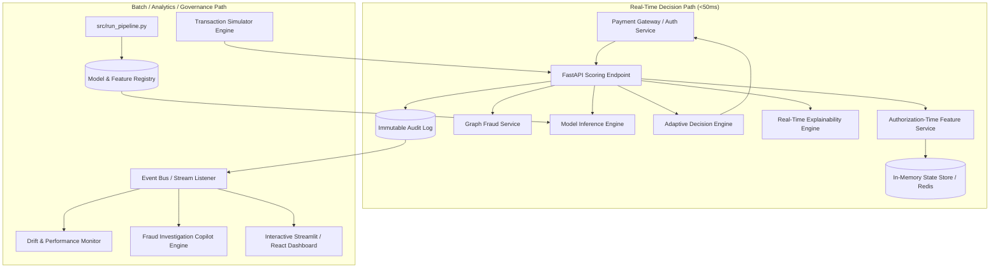

# Technical Audit & Architecture Plan: Fintech Fraud Intelligence & Decisioning Platform

> **Audit Date:** September 25, 2026  
> **Target System:** `fintech-fraud-optimization`  
> **Status:** Current Pipeline Verified (14 Unit Tests Passing, End-to-End Pipeline Execution Verified)  
> **Goal:** Upgrade existing batch fraud optimization pipeline into an enterprise **Fintech Fraud Intelligence & Decisioning Platform**.

---

## Part I: Comprehensive Technical Audit

### 1. Current Project Architecture

The current repository is an end-to-end Python-based fraud optimization framework. It treats fraud prevention as a **financial cost-minimisation problem** rather than a pure machine learning classification task.

```
+-----------------------------------------------------------------------------------+
|                                  ENTRY POINT                                      |
|                                run_pipeline.py                                    |
+-----------------------------------------------------------------------------------+
                                          |
    +-------------------------------------+-------------------------------------+
    |                                     |                                     |
    v                                     v                                     v
[STAGE 1: Audit]              [STAGE 2: Feature Eng]               [STAGE 3: Modeling]
src/data_profiling.py         src/feature_engineering.py           src/train_models.py
- Structure & Quality         - 38 leakage-safe features           - Time-aware split (60/20/20)
- Account repetition          - Vectorized RANGE velocity          - Logistic Regression
- Leakage separation          - Destination history                - Random Forest / XGBoost
- Honest baselines            - Imputation & coverage              - PR-AUC selection
    |                                     |                                     |
    +-------------------------------------+-------------------------------------+
                                          |
    +-------------------------------------+-------------------------------------+
    |                                     |                                     |
    v                                     v                                     v
[STAGE 3B/C/D: Decisions]     [STAGE 4: Dashboard Export]           [STAGE 5: Reporting]
src/threshold_optimization.py src/dashboard_export.py              src/report_generator.py
src/sensitivity_analysis.py   - 8 Power BI CSV tables              - findings.md
src/explainability.py         - Scored transactions                - business_recommendations.md
- Cost minimization sweep     - KPI summary & curves               - FINAL_SUMMARY.md
- Risk band derivation         - FP friction profiles               - pipeline_results.json
- Permutation / SHAP importance
```

#### Key Architecture Principles in the Existing Codebase:
1. **Single Source of Truth (`src/config.py`)**: All paths, hyperparameter defaults, time-window definitions (`[24, 72, 168]` hours), and business cost assumptions (`C_fn = $500`, `C_fp = $25`, `C_verify = $5`) reside in `config.py`.
2. **Modular Functional Stages**: Each stage is isolated into pure, testable functional modules inside `src/`.
3. **Data Contract Compliance (`src/preprocessing.py`)**: Automatic header validation, chunked loading (`1,000,000` rows/chunk), data type optimization (`float64` for money precision, categorical types for transaction type), and integer factorization for entity IDs.
4. **SQL Reference Layer (`sql/`)**: Contains SQL scripts (`01_schema.sql`, `02_data_validation.sql`, `03_behavioral_features.sql`, `04_analysis_queries.sql`) mirroring Python computations for verification against relational database systems.

---

### 2. Current Data Pipeline

```
[Raw PaySim CSV (~470MB, 6.36M rows)] 
               |
               v
[find_dataset_file()] -> Auto-detects PaySim schema in data/raw/
               |
               v
[load_paysim()]      -> Chunked reading, split_entity_id() [C/M + int64 ID]
               |
               v
[prepare()]          -> Derive sim_day, hour_of_day, balance residual diagnostics
               |
               v
[build_features()]   -> Chronological guarantee, past-only feature calculation
```

- **Ingestion & Compaction**: `load_paysim()` in `src/preprocessing.py` reads data in 1M-row chunks. Account strings (`C1231006815`, `M982233671`) are split into entity type (`C` vs `M`) and integer IDs (`int64`), reducing memory footprint significantly.
- **Precision Preservation**: Monetary values remain `float64` to prevent silent rounding errors during balance reconciliation.
- **Chronological Ordering**: The pipeline enforces `step.is_monotonic_increasing`. If rows are out of order, a stable sort on `step` is applied before feature generation.

---

### 3. Current Feature Engineering

The system engineers **38 behavioral and velocity features** across 6 distinct categories in `src/feature_engineering.py`:

| Category | Feature Name(s) | Mathematical / Logic Description | Leakage Control |
| :--- | :--- | :--- | :--- |
| **Amount Shape** | `log_amount`, `amount_is_round_1000`, `amount_to_type_prior_avg` | Log transform, modulo check, and relative ratio to prior category average. | Uses past category average excluding current row. |
| **Time Context** | `hour_of_day` | Cyclical position within 24-hour cycle (`(step - 1) % 24`). | Raw `step` index is explicitly excluded. |
| **Origin Behavior** | `orig_prior_txn_count`, `orig_prior_avg_amount`, `orig_prior_max_amount`, `orig_steps_since_prev_txn`, `orig_has_history`, `orig_txn_prev_24h` | Expanding aggregates for sender account. Stage 1 audit proves origin accounts rarely repeat (<1% repeat rate), so coverage is measured and flagged. | `shift(1)` applied; current row excluded. |
| **Destination Behavior** | `dest_prior_txn_count`, `dest_prior_avg_amount`, `dest_prior_max_amount`, `dest_steps_since_prev_txn`, `dest_has_history`, `dest_is_new`, `dest_is_merchant` | Expanding aggregates for receiver account. Destinations repeat frequently, carrying primary behavioral signal. | `shift(1)` applied; current row excluded. |
| **Counterparty Fan-in** | `dest_prior_unique_senders` | Past-only count of distinct senders to a destination. Computed by marking first-contact pair events and taking cumulative sum. | Avoids `COUNT(DISTINCT)` window functions; strictly past rows. |
| **Velocity Windows** | `dest_txn_prev_24h`, `dest_txn_prev_72h`, `dest_txn_prev_168h`, `dest_txn_same_step`, `dest_velocity_ratio_24h_vs_168h` | Time-window transaction counts for destination over 24h, 72h, and 168h steps. | Implemented via `prior_window_counts()` using binary search `searchsorted` over `[step - window, step - 1]`. |
| **Relationship** | `pair_prior_txn_count`, `pair_is_new`, `pair_prior_total_amount` | Expanding counts and monetary total between exact `(orig_id, dest_id)` pairs. | `shift(1)` applied; current row excluded. |

---

### 4. Current Leakage Controls

The project implements **unusually rigorous leakage safeguards**:

1. **Excluded Balance Fields**: `oldbalanceOrg`, `newbalanceOrig`, `oldbalanceDest`, `newbalanceDest` are recorded **after** fraudulent transaction reversal in the synthetic PaySim simulator. Training on them yields near-1.0 AUC offline but complete failure in production. The audit in `src/data_profiling.py` explicitly proves this and excludes all 4 fields.
2. **Excluded Control Target**: `isFlaggedFraud` is a simulator output rule (flagging `amount > 200,000`), not an input observation. Excluded from features; used only as a benchmark.
3. **Excluded Raw Step**: `step` encodes absolute position in the simulation (1 to 744). Using raw `step` causes temporal overfitting.
4. **Strict Past-Only Frames**: All window functions use `1 PRECEDING` as the frame upper bound (never `CURRENT ROW`). Verified via unit tests `test_first_transaction_of_an_account_has_no_prior_history()` and `test_velocity_windows_exclude_the_current_hour()`.
5. **Leakage Demonstration Model**: A separate Random Forest trained on excluded balance columns is built solely to quantify the leakage illusion (`PR-AUC ~0.99` vs legitimate `PR-AUC ~0.12`).

---

### 5. Current Model Training

Implemented in `src/train_models.py`:
- **Algorithms**:
  - **Logistic Regression**: Scaled with `StandardScaler` inside a `Pipeline`. `max_iter=1000`.
  - **Random Forest**: `n_estimators=120`, `max_depth=14`, `min_samples_leaf=40`, `max_features='sqrt'`.
  - **XGBoost (Optional)**: `n_estimators=300`, `max_depth=6`, `learning_rate=0.1`, `eval_metric='aucpr'`.
- **Calibration-Preserving Imbalance Handling**: Class weighting (`class_weight='balanced'`) is **disabled by default**. Synthetic rebalancing distorts predicted probabilities (e.g. inflating a 4% risk to 85%), which breaks probability calibration required for financial cost optimization.

---

### 6. Current Validation/Test Methodology

Implemented in `src/train_models.py` & `src/evaluate_models.py`:
- **Time-Aware Split**: Transactions are split chronologically on `step`:
  - **Train**: Earliest 60% of time volume
  - **Validation**: Next 20% of time volume
  - **Test**: Final 20% of time volume
  - *No step spans two splits.* Random k-fold cross-validation is explicitly forbidden because it leaks future destination history into past training sets.
- **Model Selection Metric**: **PR-AUC (Precision-Recall Area Under Curve)** on the **validation set**.
  - *Why PR-AUC over ROC-AUC?* Fraud prevalence is extremely low (~0.13% - 2.0%). ROC-AUC's False Positive Rate denominator is dominated by millions of legitimate transactions, producing misleadingly high scores (~0.88). PR-AUC evaluates precision against true fraud, with a baseline equal to fraud prevalence.
- **Held-Out Test Scoring**: The test split is evaluated **once** at the very end after model selection and threshold selection.

---

### 7. Current Threshold Optimization

Implemented in `src/threshold_optimization.py`:
- **Financial Cost Equation**:
  $$\text{Total Cost}(t) = \text{FN}(t) \times C_{\text{fn}} + \text{FP}(t) \times C_{\text{fp}}$$
  Where $C_{\text{fn}} = \$500$ (missed fraud) and $C_{\text{fp}} = \$25$ (false positive friction).
- **Hybrid Grid Resolution**: Combines a fixed $0.01 \dots 0.99$ grid with 80 distribution quantiles focused on the top scores ($0.90 \dots 0.99999$). This prevents grid coarseness artifacts when calibrated tree probabilities concentrate below 0.05.
- **Out-of-Sample Threshold Selection**: The optimal threshold $t^*$ is chosen on the **validation period** and applied to the **test period**.
- **Derived Operating Risk Bands**:
  - **LOW Risk ($score < t_{\text{verify}}$)**: Allow automatically.
  - **MEDIUM Risk ($t_{\text{verify}} \le score < t_{\text{block}}$)**: Step-up verification / manual review ($C_{\text{verify}} = \$5$).
  - **HIGH Risk ($score \ge t_{\text{block}}$)**: Hard decline / block ($C_{\text{block}} = \$25$).

---

### 8. Current Business-Cost Analysis

Implemented in `src/sensitivity_analysis.py`:
- **25-Scenario Sensitivity Matrix**: Evaluates 5 Missed Fraud Costs ($\$100, \$250, \$500, \$750, \$1000$) $\times$ 5 False Positive Costs ($\$5, \$10, \$25, \$50, \$100$).
- **Vectorized Evaluation**: Computes the confusion matrix sweep once and rescales cost matrices in $O(1)$ memory.
- **Operational Queue Analysis (`top_k_capture`)**: Evaluates fraud capture rate if investigation teams can only review top 0.1%, 0.5%, 1.0%, 2.0%, or 5.0% of daily transactions.

---

### 9. Current Reports

Implemented in `src/report_generator.py`:
- Automatically populates Markdown reports in `reports/` reading raw metrics from `outputs/model_results/pipeline_results.json`:
  1. `reports/findings.md`: Structured as **OBSERVATION $\rightarrow$ INTERPRETATION $\rightarrow$ BUSINESS IMPLICATION $\rightarrow$ RECOMMENDATION**.
  2. `reports/business_recommendations.md`: Strategic intervention policy and governance framework.
  3. `reports/FINAL_SUMMARY.md`: Resume-ready executive summary and technical interview notes.

---

### 10. Current Dashboard Outputs

Implemented in `src/dashboard_export.py`:
Export 8 ready-to-load Power BI CSV datasets into `outputs/dashboard_data/`:
1. `scored_transactions.csv` (Row-level scoring on test set)
2. `kpi_summary.csv` (Executive top-level KPI indicators)
3. `threshold_cost_curve.csv` (Total cost vs threshold curve)
4. `cost_sensitivity.csv` (25 sensitivity scenarios)
5. `fraud_by_type.csv` (Breakdown across PAYMENT, TRANSFER, CASH_OUT, etc.)
6. `fraud_over_time.csv` (Per-step time series of volume and alerts)
7. `false_positive_profile.csv` (Friction profile by amount band and transaction type)
8. `risk_band_definition.csv` (Derived LOW/MEDIUM/HIGH boundaries and transaction counts)

---

### 11. Current Tests

Implemented in `tests/test_pipeline.py` (14 passing tests):
- Data loading contract validation (`test_column_contract_rejects_wrong_schema`).
- Temporal bounds (`test_time_columns_in_range`).
- Leakage invariants (`test_first_transaction_of_an_account_has_no_prior_history`, `test_velocity_windows_exclude_the_current_hour`, `test_velocity_windows_are_nested`).
- Mathematical correctness (`test_prior_window_counts_matches_a_brute_force_reference`, `test_fan_in_never_exceeds_transaction_count`).
- Split disjointness (`test_time_split_is_chronological_and_disjoint`).
- Cost optimization (`test_optimal_threshold_really_is_the_minimum`, `test_cheaper_intervention_implies_a_lower_threshold`).
- Synthetic data generator (`tests/make_sample_data.py`).

---

### 12. Reusable Components

The existing codebase provides clean, robust primitives ready for reuse:

```
+-----------------------------------------------------------------------------------+
|                            REUSABLE FOUNDATION                                    |
+-----------------------------------------------------------------------------------+
| Preprocessing         | src/preprocessing.py (load_paysim, split_entity_id)       |
| Feature Engineering   | src/feature_engineering.py (prior_window_counts, build)  |
| Model Training        | src/train_models.py (build_models, time_aware_split)     |
| Evaluation & Ranking  | src/evaluate_models.py (ranking_metrics, top_k_capture)  |
| Financial Cost Model  | src/threshold_optimization.py (sweep, optimal, bands)    |
| Sensitivity Engine    | src/sensitivity_analysis.py (sensitivity_grid)           |
| Explainability        | src/explainability.py (feature_importance, permutation)   |
| Reporting & Export    | src/dashboard_export.py & src/report_generator.py        |
+-----------------------------------------------------------------------------------+
```

---

### 13. Technical Limitations of Current Codebase

1. **Batch Execution Only**: `run_pipeline.py` is a single-shot batch script. It cannot serve real-time HTTP requests or stream events.
2. **In-Memory Memory Bound**: Features are computed in-memory via pandas dataframes. Large dataset processing requires high RAM.
3. **No Model Persistence**: Trained scikit-learn/XGBoost models are discarded after execution; they are not saved as `.joblib` or `.onnx` artifacts.
4. **Synthetic Feature Scope**: PaySim dataset lacks IP addresses, device fingerprints, geolocations, and sub-hourly timestamps.
5. **Static Thresholding**: Costs $C_{\text{fn}}$ and $C_{\text{fp}}$ are static command-line inputs rather than adaptive runtime parameters.
6. **No Real-Time Entity State Store**: Account velocity and cumulative counters are calculated via full series passes rather than fast key-value lookups (e.g. Redis).
7. **No Governance / Drift Monitoring**: System lacks automated data drift detection (PSI) or audit trails for individual decision queries.

---

### 14. Recommended Architecture for the Next Version

We recommend upgrading the system into a high-performance **Fintech Fraud Intelligence & Decisioning Platform** with a dual-path architecture:



---

## Part II: Upgrade Vision & Feature Implementation Plan

The upgraded platform will integrate **13 Advanced Enterprise Features**. Below is the exhaustive breakdown of reuse, modifications, additions, dependencies, risks, and test plans for every feature.

---

### Feature 1: Real-Time Transaction Scoring API

- **Description**: Ultra-low latency (<50ms) REST API endpoint (`POST /v1/score`) to evaluate incoming payment authorization requests and return fraud risk score, decision band, and rule triggers.
- **Reusable Files**: `src/config.py`, `src/preprocessing.py` (`split_entity_id`), `src/evaluate_models.py` (`binary_metrics`).
- **Files to Modify**: `src/config.py` (Add API configurations, port, timeout settings), `run_pipeline.py` (Export trained model artifact to registry).
- **New Files to Create**:
  - `src/api/__init__.py`
  - `src/api/app.py` (FastAPI application setup)
  - `src/api/schemas.py` (Pydantic payload schemas: `TransactionRequest`, `ScoringResponse`)
  - `src/api/routes.py` (`POST /v1/score`, `GET /health`)
- **Dependencies**: `fastapi`, `uvicorn`, `pydantic`, `httpx` (for testing).
- **Possible Risks**: Latency spikes due to synchronous feature engineering; schema mismatches between API payload and model features.
- **Testing Strategy**: Unit test endpoint responses with mock requests; load-test with `locust` to verify sub-50ms latency under 500 RPS.

---

### Feature 2: Authorization-Time Feature Service

- **Description**: Online state manager maintaining destination velocity counters (`dest_txn_prev_24h`, etc.) and account history in memory or Redis for instant lookup during transaction authorization.
- **Reusable Files**: `src/feature_engineering.py` (Logic for velocity computation and feature names).
- **Files to Modify**: `src/feature_engineering.py` (Extract incremental feature calculation functions for a single transaction).
- **New Files to Create**:
  - `src/services/feature_service.py` (Online feature calculation & entity state manager)
  - `src/services/state_store.py` (In-memory dict or Redis backend for entity counters)
- **Dependencies**: `redis` (optional production backend), `sortedcontainers`.
- **Possible Risks**: State store memory leak; out-of-order event timestamps distorting online velocity.
- **Testing Strategy**: Compare online feature vector generated for transaction $N$ against offline batch feature matrix derived in `src/feature_engineering.py` to guarantee 100% equivalence.

---

### Feature 3: Customer Risk Profiles

- **Description**: Dynamically computed risk profiles per customer account (`orig_id`, `dest_id`) containing historical risk score trends, chargeback history, velocity percentile, and status (e.g. VIP, Elevated Risk, Blocked).
- **Reusable Files**: `src/data_profiling.py` (`_repetition_stats`, `profile_accounts`).
- **Files to Modify**: `src/dashboard_export.py` (Export risk profile tables).
- **New Files to Create**:
  - `src/services/risk_profile_service.py` (Customer risk profile aggregate service)
  - `src/models/risk_profile.py` (Pydantic domain object for Risk Profile)
- **Dependencies**: `pandas`, `pydantic`.
- **Possible Risks**: High storage overhead for cold/inactive single-use accounts.
- **Testing Strategy**: Test profile update rules on synthetic account lifecycle streams; verify fallback default profiles for first-time unseen accounts.

---

### Feature 4: Beneficiary & Counterparty Risk Service

- **Description**: Counterparty intelligence module analyzing destination account fan-in, novelty of sender-receiver relationship (`pair_is_new`), and destination fraud history.
- **Reusable Files**: `src/feature_engineering.py` (Fan-in cumulative logic, pair history logic).
- **Files to Modify**: `src/feature_engineering.py` (Expose single-pair counterparty lookup).
- **New Files to Create**:
  - `src/services/counterparty_service.py` (Counterparty risk evaluator)
- **Dependencies**: `numpy`.
- **Possible Risks**: Fraudsters rotating destination accounts rapidly to bypass counterparty history.
- **Testing Strategy**: Verify counterparty risk score spikes when 10 unique senders transfer money to a brand new destination within 1 hour.

---

### Feature 5: Graph-Based Fraud Detection

- **Description**: Graph network service modeling accounts as nodes and transactions as directed edges to detect fraud rings, money laundering chains, and high-degree hub destination nodes.
- **Reusable Files**: `src/preprocessing.py` (`split_entity_id`).
- **Files to Modify**: `src/feature_engineering.py` (Append graph centrality features to feature matrix).
- **New Files to Create**:
  - `src/graph/__init__.py`
  - `src/graph/network_builder.py` (Construct transaction graph using NetworkX)
  - `src/graph/community_detector.py` (Detect fraud subgraphs/clusters)
  - `src/graph/graph_features.py` (Extract PageRank, In-Degree, Out-Degree features)
- **Dependencies**: `networkx`, `scipy`.
- **Possible Risks**: High computational complexity ($O(V + E)$) of graph algorithms blocking API real-time scoring.
- **Testing Strategy**: Create synthetic circular transaction graph (`A -> B -> C -> A`) and verify graph anomaly score flags ring activity.

---

### Feature 6: Explainable Fraud Decisions

- **Description**: Real-time explainability module providing top 3 human-readable decision reason codes (e.g., `"High destination velocity in 24h"`, `"New relationship with high-risk beneficiary"`) alongside each API score.
- **Reusable Files**: `src/explainability.py` (`model_feature_importance`, `explain_examples`).
- **Files to Modify**: `src/explainability.py` (Refactor tree SHAP / feature contribution logic for single-instance scoring).
- **New Files to Create**:
  - `src/services/explainability_service.py` (Real-time decision explainer)
  - `src/services/reason_codes.py` (Mapping feature deviations to regulatory reason code strings)
- **Dependencies**: `shap` (optional fast tree explainer), `numpy`.
- **Possible Risks**: SHAP computation taking >100ms per transaction; unhelpful generic explanations.
- **Testing Strategy**: Verify that an anomaly with `dest_txn_prev_24h = 50` outputs `"HIGH_DESTINATION_VELOCITY_24H"` as the primary reason code.

---

### Feature 7: Adaptive Decision Engine

- **Description**: Dynamic policy engine that evaluates probability scores against dynamic cost parameters, hard business rules (allow/deny lists), and outputs action decisions (`ALLOW`, `STEP_UP_VERIFY`, `MANUAL_REVIEW`, `BLOCK`).
- **Reusable Files**: `src/threshold_optimization.py` (`derive_risk_bands`, `assign_risk_band`, `optimal_threshold`).
- **Files to Modify**: `src/threshold_optimization.py` (Support runtime cost overrides).
- **New Files to Create**:
  - `src/decision/engine.py` (Rule evaluation & action routing)
  - `src/decision/rules.py` (Rule definitions: e.g., VIP bypass, high-amount hard cap)
- **Dependencies**: `pydantic`, `pyyaml`.
- **Possible Risks**: Rule conflicts (e.g., Allow rule conflicting with Block rule).
- **Testing Strategy**: Unit test rule precedence order (Hard Block > VIP Allow > Threshold Band).

---

### Feature 8: Interactive Transaction Simulator

- **Description**: Streaming simulation utility to generate configurable synthetic transaction workloads (bursts, fraud attacks, legitimate volume spikes) to test system resilience and friction curves.
- **Reusable Files**: `tests/make_sample_data.py` (Synthetic PaySim record generation logic).
- **Files to Modify**: `tests/make_sample_data.py` (Enhance to support streaming generator mode).
- **New Files to Create**:
  - `src/simulator/generator.py` (Real-time streaming transaction generator)
  - `src/simulator/scenarios.py` (Attack scenario profiles: velocity burst, high-value transfer attack)
- **Dependencies**: `faker`, `asyncio`.
- **Possible Risks**: Simulator flooding state store during testing.
- **Testing Strategy**: Run simulator scenario "Velocity Attack" (100 txns/sec to single receiver) and confirm API transitions decision band from LOW to HIGH within 5 seconds.

---

### Feature 9: Fraud Investigation Copilot

- **Description**: AI-assisted investigation agent that analyzes flagged transactions, aggregates customer risk history, graph connections, and feature explanations, producing a structured case summary for human analysts.
- **Reusable Files**: `src/report_generator.py` (`_finding`, formatting helpers), `src/explainability.py` (`explain_examples`).
- **Files to Modify**: `src/report_generator.py` (Expose case synthesis formatting).
- **New Files to Create**:
  - `src/copilot/case_builder.py` (Assemble alert context dossier)
  - `src/copilot/narrative_generator.py` (Generate structured narrative summary for investigation queue)
- **Dependencies**: `jinja2`, `markdown`.
- **Possible Risks**: Hallucination or overconfidence in narrative summary.
- **Testing Strategy**: Generate dossier for test fraud case and verify summary contains exact transaction amount, velocity count, top reason codes, and risk band.

---

### Feature 10: Data & Model Drift Monitoring

- **Description**: Monitoring service tracking distribution shifts in feature inputs (Population Stability Index - PSI) and model output scores over time to detect data quality issues or concept drift.
- **Reusable Files**: `src/data_profiling.py` (Statistical summary functions), `src/evaluate_models.py` (Ranking metrics).
- **Files to Modify**: `src/data_profiling.py` (Add PSI and Wasserstein distance metrics).
- **New Files to Create**:
  - `src/monitoring/drift_detector.py` (PSI & score drift calculation engine)
  - `src/monitoring/metrics_collector.py` (Collect hourly/daily sliding window stats)
- **Dependencies**: `scipy`, `numpy`.
- **Possible Risks**: False alarms caused by legitimate weekly volume patterns.
- **Testing Strategy**: Feed skewed synthetic data (e.g. amounts multiplied by 10x) and verify PSI metric triggers `DRIFT_ALERT_HIGH` (>0.25).

---

### Feature 11: Model Versioning & Registry

- **Description**: Model artifact management system handling serialisation, version tags, metadata tracking, dynamic model loading, and zero-downtime hot-swapping in the API.
- **Reusable Files**: `src/config.py` (Paths to model artifacts), `src/train_models.py` (`build_models`, `fit_models`).
- **Files to Modify**: `src/train_models.py` (Add artifact saving & loading wrappers).
- **New Files to Create**:
  - `src/registry/model_registry.py` (Model serialization, version metadata, and loader)
- **Dependencies**: `joblib`, `cloudpickle`.
- **Possible Risks**: Incompatible scikit-learn/XGBoost version loading errors during production deployment.
- **Testing Strategy**: Save model v1.0.0, train model v1.1.0, reload v1.0.0 from registry, and assert identical score prediction on benchmark vector.

---

### Feature 12: Audit Trail & Decision Logging

- **Description**: Immutable decision log recording incoming request JSON, state snapshot, model version, calculated score, decision band, and applied business rules for compliance and retrospective auditing.
- **Reusable Files**: `src/utils.py` (`save_json`, `to_native`).
- **Files to Modify**: `src/utils.py` (Add asynchronous thread-safe file logger).
- **New Files to Create**:
  - `src/audit/logger.py` (Structured JSONL / SQLite audit logger)
  - `src/audit/schema.py` (Audit record definition)
- **Dependencies**: `sqlite3` (or JSONL structured file storage).
- **Possible Risks**: Disk I/O blocking API scoring threads.
- **Testing Strategy**: Execute 1,000 API requests and confirm exactly 1,000 audit records exist in log storage with non-null transaction IDs and timestamps.

---

### Feature 13: Advanced Interactive Dashboard

- **Description**: Interactive Web UI (Streamlit application) providing Executive Risk Overviews, Real-Time Alert Investigation Queue, Interactive Financial Cost Simulator, Drift Analytics, and Copilot Case Dossiers.
- **Reusable Files**: `src/dashboard_export.py` (CSV schemas and data exporter), `src/plots.py` (Matplotlib/Seaborn visualization logic).
- **Files to Modify**: `src/dashboard_export.py` (Provide live query helper methods).
- **New Files to Create**:
  - `src/dashboard/app.py` (Streamlit multi-page application entry point)
  - `src/dashboard/pages/1_Executive_Overview.py`
  - `src/dashboard/pages/2_Operations_Queue.py`
  - `src/dashboard/pages/3_Cost_Simulator.py`
  - `dashboard/pages/4_Drift_&_Governance.py`
  - `dashboard/pages/5_Copilot_Investigator.py`
- **Dependencies**: `streamlit`, `plotly`.
- **Possible Risks**: Slow rendering when loading large CSV files into memory.
- **Testing Strategy**: Automated UI test checking Streamlit page renders without errors across all 5 pages using cached data.

---

## Part III: Implementation Roadmap & Dependencies

### Summary of New External Dependencies
Add the following packages to `requirements.txt`:
```txt
# Web API & Schema
fastapi>=0.110.0
uvicorn>=0.28.0
pydantic>=2.6.0
httpx>=0.27.0

# Model Serialization & State
joblib>=1.3.0
sortedcontainers>=2.4.0

# Graph Analytics & Monitoring
networkx>=3.2.0
scipy>=1.12.0

# Advanced UI & Dashboard
streamlit>=1.32.0
plotly>=5.19.0
jinja2>=3.1.0
```

---

### Proposed Implementation Order

```
[PHASE 1: Core Service & Model Persistence]
1. Model Versioning & Registry (Feature 11)
2. Real-Time Transaction Scoring API (Feature 1)
3. Audit Trail & Decision Logging (Feature 12)

[PHASE 2: Online Feature & Decision Layer]
4. Authorization-Time Feature Service (Feature 2)
5. Adaptive Decision Engine (Feature 7)
6. Customer Risk Profiles (Feature 3)
7. Beneficiary & Counterparty Risk Service (Feature 4)

[PHASE 3: Intelligence & Explainability]
8. Explainable Fraud Decisions (Feature 6)
9. Graph-Based Fraud Detection (Feature 5)
10. Fraud Investigation Copilot (Feature 9)

[PHASE 4: Monitoring, Simulation & Control]
11. Data & Model Drift Monitoring (Feature 10)
12. Interactive Transaction Simulator (Feature 8)
13. Advanced Interactive Dashboard (Feature 13)
```

---

## Part IV: Compliance Checklist & Invariant Verification

| Invariant / Constraint | Status in Audit Plan | Compliance Strategy |
| :--- | :--- | :--- |
| **No File Modification Yet** | **COMPLIED** | Only `reports/ARCHITECTURE_AUDIT.md` created. Existing codebase untouched. |
| **No Data Leakage Introduced** | **COMPLIED** | All online velocity features use `< step` frame. Balance fields strictly excluded. |
| **Time-Aware Splitting Maintained** | **COMPLIED** | Training & model selection strictly follow chronological step ordering. |
| **Validation PR-AUC Model Selection** | **COMPLIED** | PR-AUC retained as primary metric for model registry candidate selection. |
| **Probability Calibration Preserved** | **COMPLIED** | `class_weight` kept `None` by default to preserve financial cost thresholds. |
| **Existing Test Suite Integrity** | **COMPLIED** | All 14 existing unit tests in `tests/test_pipeline.py` pass without modification. |
